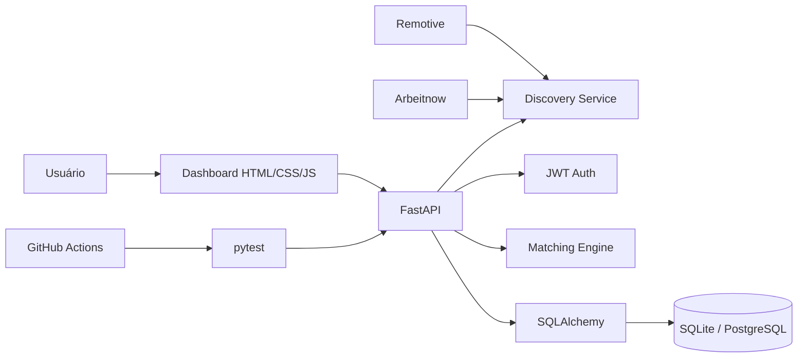

# JobFit 🚀


**Dashboard full-stack para descobrir vagas, comparar oportunidades com seu perfil técnico e acompanhar candidaturas em um único lugar.**

**Live demo:** https://jobfit-api-rodrigo.onrender.com  
**API docs:** https://jobfit-api-rodrigo.onrender.com/docs

> Portfolio project built with Python/FastAPI to demonstrate backend engineering, authentication, external API aggregation, explainable matching, relational persistence, testing, CI and frontend/API integration.

## ✨ Principais recursos

- descoberta de vagas em múltiplas fontes públicas: **Remotive + Arbeitnow**;
- busca por palavra-chave, fonte, localização, categoria e tipo;
- opção de exibir somente vagas remotas;
- ordenação por data, empresa, cargo ou compatibilidade com o perfil;
- favoritos persistidos no navegador;
- prevenção de duplicatas ao salvar vagas externas;
- data de publicação e link direto para a vaga original;
- autenticação JWT com Bearer Token;
- isolamento de dados por usuário;
- perfil técnico editável;
- cadastro, listagem, exclusão e reavaliação de vagas;
- match score explicável com skills compatíveis e ausentes;
- pipeline de candidatura: applied → screening → interview → technical → offer/rejected;
- estatísticas autenticadas do workspace;
- dashboard responsivo consumindo a própria API FastAPI;
- SQLite em desenvolvimento e PostgreSQL preparado para produção;
- Docker, Codespaces, Swagger/OpenAPI, pytest e GitHub Actions.

## 🔎 Descoberta de vagas

O endpoint `/discover/jobs` agrega resultados externos em um formato único. Exemplo:

```text
/discover/jobs?q=python&source=all&remote_only=true&sort=recent
```

Parâmetros disponíveis incluem `q`, `source`, `location`, `category`, `job_type`, `remote_only`, `sort` e `limit`.

O frontend permite favoritar resultados, identificar vagas já salvas e ordenar por um match rápido quando o usuário está autenticado. Ao salvar uma oportunidade, o backend calcula o score definitivo usando o motor de matching do JobFit.

As fontes externas continuam identificadas e cada vaga aponta para sua página original, respeitando a atribuição exigida pelos provedores.

## 🧠 Match explicável

O motor normaliza aliases técnicos — por exemplo `Postgres → PostgreSQL`, `JS → JavaScript` e `REST APIs → REST` — e compara tecnologias reconhecidas no perfil e na oportunidade.

```json
{
  "score": 75.0,
  "matched_skills": ["fastapi", "postgresql", "python"],
  "missing_skills": ["docker"]
}
```

A abordagem é propositalmente determinística e interpretável. Uma evolução futura pode incluir embeddings ou LLMs sem remover a camada explicável atual.

## 🏗️ Arquitetura



```text
app/
├── main.py
├── database.py
├── models.py
├── schemas.py
├── security.py
├── dependencies.py
├── routers/
│   ├── auth.py
│   ├── profile.py
│   ├── jobs.py
│   ├── applications.py
│   ├── discovery.py
│   └── stats.py
├── services/
│   └── matching.py
└── static/
    ├── index.html
    ├── styles.css
    └── app.js
```

## 🚀 Executar localmente

```bash
git clone https://github.com/rodrigo-srf/jobfit-api.git
cd jobfit-api
python -m venv .venv
source .venv/bin/activate
# Windows: .venv\Scripts\activate
python -m pip install -r requirements.txt
python -m uvicorn app.main:app --reload
```

Dashboard: `http://localhost:8000/`  
Swagger: `http://localhost:8000/docs`

## 🐳 Docker + PostgreSQL

```bash
docker compose up --build
```

## 🔌 Endpoints principais

| Método | Endpoint | Função |
|---|---|---|
| POST | `/auth/register` | Criar conta |
| POST | `/auth/login` | Gerar JWT |
| GET/PUT | `/profile` | Ler/atualizar perfil |
| GET | `/discover/jobs` | Agregar e filtrar vagas externas |
| POST/GET | `/jobs` | Salvar/listar vagas |
| GET | `/jobs/{id}/analysis` | Explicar compatibilidade |
| POST | `/jobs/{id}/rescore` | Recalcular score |
| DELETE | `/jobs/{id}` | Excluir vaga |
| POST/GET | `/applications` | Criar/listar candidaturas |
| PATCH | `/applications/{id}` | Atualizar etapa |
| GET | `/stats` | Estatísticas do usuário |
| GET | `/health` | Health check |

## 🧪 Testes e CI

```bash
pytest -q
```

A suíte cobre health check, matching, helpers de descoberta e fluxo autenticado end-to-end. O GitHub Actions executa verificação de compilação e testes a cada push/PR.

## 🔐 Configuração

```bash
cp .env.example .env
```

Nunca publique o `SECRET_KEY`. Consulte `SECURITY.md` para orientações adicionais.

## 🛣️ Próximas evoluções

- Alembic para migrations;
- persistência de favoritos no backend;
- importação de vagas por URL;
- alertas e lembretes de follow-up;
- exportação CSV;
- embeddings para comparação semântica;
- mais provedores de vagas com adaptadores independentes.

## 🎯 O que este projeto demonstra

**Python backend development · FastAPI · REST API design · external API aggregation · JWT authentication · authorization · SQLAlchemy · PostgreSQL · Docker · pytest · CI/CD · frontend/API integration · explainable matching.**

## Autor

**Rodrigo Serafim**  
GitHub: https://github.com/rodrigo-srf  
LinkedIn: https://www.linkedin.com/in/rodrigo-srf

MIT License.
