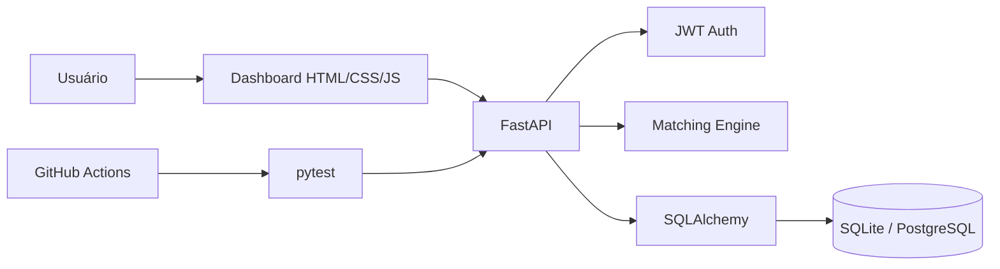

# JobFit 🚀


**Dashboard full-stack para organizar vagas, acompanhar candidaturas e medir a compatibilidade entre o perfil técnico do usuário e os requisitos de cada oportunidade.**

> Portfolio project built with Python/FastAPI to demonstrate backend engineering, authentication, relational persistence, explainable matching, testing, CI and a functional web interface.

## ✨ O que o projeto faz

O JobFit permite criar uma conta, cadastrar suas skills, salvar oportunidades e acompanhar o processo seletivo em um pipeline visual. Cada vaga recebe um **match score explicável**, com skills compatíveis e skills que ainda faltam no perfil.

A interface web consome a própria API FastAPI — não é apenas uma tela estática. Login, perfil, vagas, scores e candidaturas usam os endpoints reais do backend.

### Principais recursos

- autenticação JWT com Bearer Token;
- isolamento dos dados por usuário;
- perfil técnico editável;
- cadastro, listagem, exclusão e reavaliação de vagas;
- match score baseado em skills técnicas normalizadas;
- explicação do score com `matched_skills` e `missing_skills`;
- pipeline de candidatura: applied → screening → interview → technical → offer/rejected;
- estatísticas autenticadas do workspace;
- dashboard responsivo integrado à API;
- SQLite para desenvolvimento e PostgreSQL via Docker Compose;
- documentação automática Swagger/OpenAPI;
- testes unitários e fluxo end-to-end autenticado com pytest;
- CI com GitHub Actions;
- ambiente Codespaces/devcontainer com Python 3.12;
- blueprint `render.yaml` para deploy com PostgreSQL.

## 🖥️ Dashboard

Depois de iniciar a aplicação, abra:

```text
http://localhost:8000/
```

A interface permite realizar todo o fluxo principal sem precisar montar `curl` manualmente.

A documentação técnica continua disponível em:

```text
http://localhost:8000/docs
```

## 🧠 Match explicável

O motor de matching normaliza aliases técnicos — por exemplo `Postgres → PostgreSQL`, `JS → JavaScript` e `REST APIs → REST` — e prioriza termos reconhecidos como tecnologias.

Exemplo de análise:

```json
{
  "score": 75.0,
  "matched_skills": ["fastapi", "postgresql", "python"],
  "missing_skills": ["docker"],
  "profile_skills": ["fastapi", "postgresql", "python"],
  "required_skills": ["docker", "fastapi", "postgresql", "python"]
}
```

Essa abordagem é propositalmente determinística, barata e explicável. Uma evolução futura pode incluir embeddings ou LLMs sem remover a camada interpretável atual.

## 🏗️ Arquitetura



```text
app/
├── main.py
├── database.py
├── models.py
├── schemas.py
├── security.py
├── dependencies.py
├── routers/
│   ├── auth.py
│   ├── profile.py
│   ├── jobs.py
│   ├── applications.py
│   └── stats.py
├── services/
│   └── matching.py
└── static/
    ├── index.html
    ├── styles.css
    └── app.js
```

## 🚀 Executar localmente

```bash
git clone https://github.com/rodrigo-srf/jobfit-api.git
cd jobfit-api
python -m venv .venv
source .venv/bin/activate
# Windows: .venv\Scripts\activate
python -m pip install -r requirements.txt
python -m uvicorn app.main:app --reload
```

Abra `http://localhost:8000/`.

## 🐳 Docker + PostgreSQL

```bash
docker compose up --build
```

A API ficará disponível na porta `8000` e usará PostgreSQL pelo serviço `db` do Compose.

## ☁️ GitHub Codespaces

O repositório inclui `.devcontainer/devcontainer.json`. Ao criar um Codespace, o ambiente usa Python 3.12, cria `.venv` e instala as dependências automaticamente.

Depois:

```bash
source .venv/bin/activate
python -m uvicorn app.main:app --reload --host 0.0.0.0
```

Abra a porta encaminhada `8000`.

## 🌍 Deploy

O arquivo `render.yaml` deixa o projeto preparado para um Blueprint no Render com serviço Docker + PostgreSQL. O backend também normaliza URLs `postgres://` e `postgresql://` para o driver psycopg 3 automaticamente.

No deploy, mantenha `SECRET_KEY` como segredo gerado pelo provedor e use `/health` como health check.

## 🔌 Endpoints principais

| Método | Endpoint | Função |
|---|---|---|
| POST | `/auth/register` | Criar conta |
| POST | `/auth/login` | Gerar JWT |
| GET/PUT | `/profile` | Ler/atualizar perfil |
| POST/GET | `/jobs` | Salvar/listar vagas |
| GET | `/jobs/{id}/analysis` | Explicar compatibilidade |
| POST | `/jobs/{id}/rescore` | Recalcular score |
| DELETE | `/jobs/{id}` | Excluir vaga |
| POST/GET | `/applications` | Criar/listar candidaturas |
| PATCH | `/applications/{id}` | Atualizar etapa |
| GET | `/stats` | Estatísticas do usuário |
| GET | `/health` | Health check |
| GET | `/api` | Metadados da API |

## 🧪 Testes

```bash
pytest -q
```

A suíte cobre health check, dashboard, aliases do motor de matching, explicação de skills ausentes e um fluxo end-to-end com **registro → login → perfil → vaga → análise → candidatura → entrevista → estatísticas** usando banco SQLite isolado em memória.

O GitHub Actions também executa uma verificação de compilação antes dos testes.

## 🔐 Configuração

Copie `.env.example` e altere os valores antes de uso fora de desenvolvimento:

```bash
cp .env.example .env
```

Em produção, use um `SECRET_KEY` forte e um banco PostgreSQL gerenciado. Consulte também `SECURITY.md`.

## 🛣️ Próximas evoluções

- Alembic para migrations;
- refresh tokens;
- filtros avançados por salário, senioridade e modalidade;
- importação de vagas por URL;
- lembretes de follow-up;
- exportação CSV;
- embeddings para comparação semântica;
- deploy público contínuo.

## 🎯 O que este projeto demonstra

**Python backend development · FastAPI · REST API design · JWT authentication · authorization · SQLAlchemy · PostgreSQL · Docker · pytest · CI/CD fundamentals · frontend/API integration · explainable text matching.**

## Autor

**Rodrigo Serafim**  
GitHub: https://github.com/rodrigo-srf  
LinkedIn: https://www.linkedin.com/in/rodrigo-srf

MIT License.
