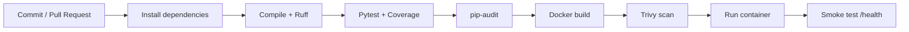

# DevOps Pipeline

This document explains the CI pipeline used by JobFit and the DevOps concepts demonstrated by the project.

## Pipeline stages

Every pull request to `main` and every push to `main` runs two jobs.

### 1. Quality and tests

The first job validates the Python application before a container is built.

- installs the application dependencies;
- compiles the application modules;
- runs Ruff checks for critical Python errors;
- executes the Pytest suite;
- generates a coverage report;
- audits Python dependencies with `pip-audit`;
- stores `coverage.xml` as a short-lived GitHub Actions artifact.

### 2. Container build and security

The second job only starts after the quality job succeeds.

- builds the production Docker image;
- scans the image for critical vulnerabilities with Trivy;
- starts the built image using isolated CI environment variables;
- performs an HTTP smoke test against `/health`;
- prints container logs for troubleshooting;
- removes the temporary CI container.

## Pipeline flow



## Skills demonstrated

- CI/CD fundamentals with GitHub Actions
- automated testing with Pytest
- code-quality checks with Ruff
- test coverage collection
- dependency vulnerability auditing
- Docker image build
- container vulnerability scanning with Trivy
- health checks and smoke tests
- CI environment-variable management
- troubleshooting through container logs

## Local equivalents

```bash
pytest -q
ruff check app tests --select E9,F63,F7,F82
pip-audit -r requirements.txt
docker build -t jobfit-api:local .
```
